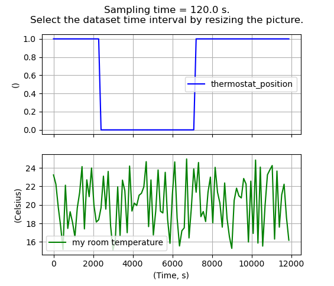
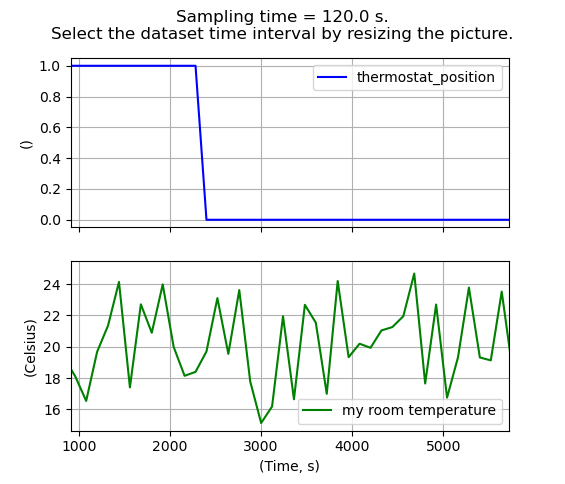

.. _create_dataset:

##########################################
 Create, analyze and manipulate a dataset
##########################################

Measurement data formats depend on many aspects such as the specific
application domain, the logging system, the manufacturer, and so on. Due to
this variability, it is impossible to establish a unified measurements format
that fits every domain. Each domain has its own requirements. Therefore, we
need to find a solution.

Dymoval defines a :ref:`Signal <signal>` object type that is general enough to
capture all the aspects of a signal, regardless of its application domain. At
the end, when dealing with a time-serie, we are interested in the following
attributes:

-  signal name,
-  signal values,
-  signal units,
-  sampling period,
-  time unit.

and a :ref:`Signal <signal>` object store exactly this information and can be
created as it follows:

.. code::

   from dymoval.dataset import Signal
   from numpy.random import default_rng

   # Generate random temperature values
   signal_values = default_rng().uniform(low=15, high=25, size=100)
   # Create a dymoval Signal
   room_temperature: Signal ={
           "name": "my room temperature",
           "samples": signal_values,
           "signal_unit": "Celsius",
           "sampling_period": 120,
           "time_unit": "s",
           }

As a first step to using Dymoval, each logged signal must be cast into a
Dymoval :ref:`Signal <signal>`. Once this is done, a list of such
:ref:`Signals <signal>` can be used to create a :ref:`Dataset <Dataset>`
object. This represents the measurement dataset against which the simulated
outputs will be evaluated.

To create a :ref:`Dataset <dataset>` object, we need at least one input and
one output, therefore we assume that the room temperature of the example below
is an output and a thermostat position is the *input* signal:

.. code::

   # ...continued
   import numpy as np
   from dymoval.dataset import Dataset
   # Generate random thermostat position
   thermostat_pos = np.concatenate((np.ones(20), np.zeros(40), np.ones(40)))
   # Create a dymoval Signal
   thermostat_pos: Signal ={
           "name": "thermostat_position",
           "samples": thermostat_pos,
           "signal_unit": "",
           "sampling_period": 120,
           "time_unit": "s",
           }
   input_name = thermostat_pos['name']
   output_name = room_temperature['name']
   # Create the actual Dataset object
   ds = Dataset("my dataset", [thermostat_pos, room_temperature] , input_name, output_name)

You should get a figure like the following:

At this point you can graphically trim the time-axis to select only a desired
portion of measurements data that you want to use for validation purpose:

.. note::

   Visual trimming of the :ref:`Dataset <dataset>` object is allowed only if
   you are using an interactive ``matplotlib`` backend like ``qtagg``.
   However, if you are not using an interactive backend, you can still trim
   your Dataset object by passing the arguments ``tin`` and ``tout`` to the
   constructor or by passing them to the :ref:`~dymoval.dataset.Dataset.trim`
   method.

It is worth mentioning that when dealing with measurement datasets, several
problems arise:

-  Signals may be sampled at different rates.

-  Data loggers may run continuously for hours, logging data even when nothing
   interesting is happening, resulting in large log files with little
   information.

-  Logs are often affected by other issues such as noisy measurements, missing
   data, and so on.

Dymoval provides a number of functions for dealing with :ref:`Dataset
<Dataset>` objects, including re-sampling, plotting, frequency analysis,
filtering, and more.

Once you have created and adjusted a measurement :ref:`Dataset <Dataset>`
object, you are ready to simulate your model.

..
   vim: set ts=2 tw=78:
