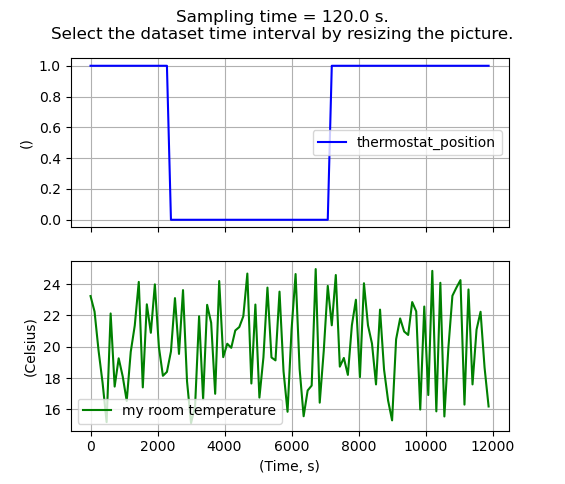
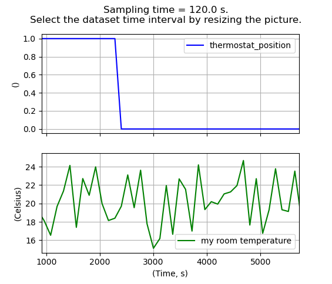

.. _create_dataset:

##########################################
 Create, analyze and manipulate a dataset
##########################################

Measurement data formats depend on the application domain, the logging system,
the manufacturer, and so on. Such a variability makes a unified measurements
format impossible, so *dymoval* defines its own: the :ref:`Signal <signal>`.

Whatever the domain, a time-series is described by the same handful of
attributes:

-  a name,
-  the sampled values,
-  the time instants at which they were sampled,
-  the unit of the values,
-  the unit of the time.

A :ref:`Signal <signal>` stores exactly that:

.. code::

   import numpy as np
   from dymoval import Signal

   time = np.arange(0, 12000, 120.0)  # 100 samples, one every two minutes
   values = np.random.default_rng().uniform(low=15, high=25, size=100)

   room_temperature = Signal(
       name="room temperature",
       values=values,
       time=time,
       unit="Celsius",
       time_unit="s",
   )

The first step of every *dymoval* session is to cast each logged channel into
a :ref:`Signal <signal>`. Those signals are then grouped into a :ref:`Dataset
<Dataset>`, which is the measurement data against which simulated outputs will
be evaluated.

A :ref:`Dataset <Dataset>` needs at least one input and one output. Let's take
the room temperature above as the output and add a thermostat position as the
input:

.. code::

   # ...continued
   from dymoval import Dataset

   thermostat_pos = Signal(
       name="thermostat position",
       values=np.concatenate((np.ones(20), np.zeros(40), np.ones(40))),
       time=time,
       unit="",
       time_unit="s",
   )

   ds = Dataset.from_signals(
       inputs=[thermostat_pos],
       outputs=[room_temperature],
       name="my dataset",
   )

   ds.plot()

You should get a figure like the following:

The two signals above happen to share a time vector, but that is not required:
:py:meth:`~dymoval.dataset.Dataset.from_signals` resamples everything onto a
common uniform grid. By default that grid uses the largest sampling period
among the passed signals and spans only the interval covered by all of them,
so that no extrapolation takes place. Pass ``target_sampling_period`` to
choose the grid yourself.

Trimming
========

Data loggers often run for hours, recording long stretches where nothing
interesting happens. To keep only the portion you care about, *trim* the time
axis:

.. code::

   ds_trimmed = ds.trim(1200.0, 6000.0)

The same method exists on a single :ref:`Signal <signal>`.

Calling ``ds.trim()`` with *no* time interval opens the dataset plot and lets
you pick the interval graphically: zoom on the region you want to keep, then
close the window. Pass signal names to plot only some of them, e.g.
``ds.trim("room temperature")``.

Missing data
------------

Loggers routinely leave ``NaN`` samples at the beginning, at the end, or in
the middle of a recording. Locate them with ``ds.nan_intervals()`` — they are
also shaded in every time plot — and fill them by interpolation with

.. code::

   ds_clean = ds.remove_nans()

Gaps at the very beginning or at the very end have no left/right neighbour to
interpolate between and are simply held constant, so a long one is better
trimmed away than interpolated. Since a :ref:`Dataset <Dataset>` requires a
common, uniformly sampled time vector, dropping the ``NaN`` samples outright
is only possible on a single :ref:`Signal <signal>`
(``sig.remove_nans(fill="drop")``), before the :ref:`Dataset <Dataset>` is
built.

.. note::

   Remember that *dymoval* objects are immutable: ``ds.trim(...)`` returns a
   new :ref:`Dataset <Dataset>` and leaves ``ds`` untouched. The same holds
   for every other manipulation method.

Analyzing and manipulating
==========================

Measurement logs are rarely usable as they are: signals are sampled at
different rates, measurements are noisy, sensors drift. *Dymoval* covers the
usual remedies and analyses with the methods listed in :ref:`datasetMethods`,
among which:

.. code::

   ds_filtered = ds.low_pass_filter(("room temperature", 0.01))
   ds_zero_mean = ds.remove_mean()
   ds_detrended = ds.detrend()

   frequencies, spectrum = ds.spectrum()["room temperature"]
   ds.plot_spectrum()
   ds.plot_coverage()
   ds.plot_xy()   # one XY plot per input/output pair

See :ref:`figure_geometry` for how to resize and restyle any of these
figures.

Once your measurement :ref:`Dataset <Dataset>` is ready, you can move on to
simulating your model.
