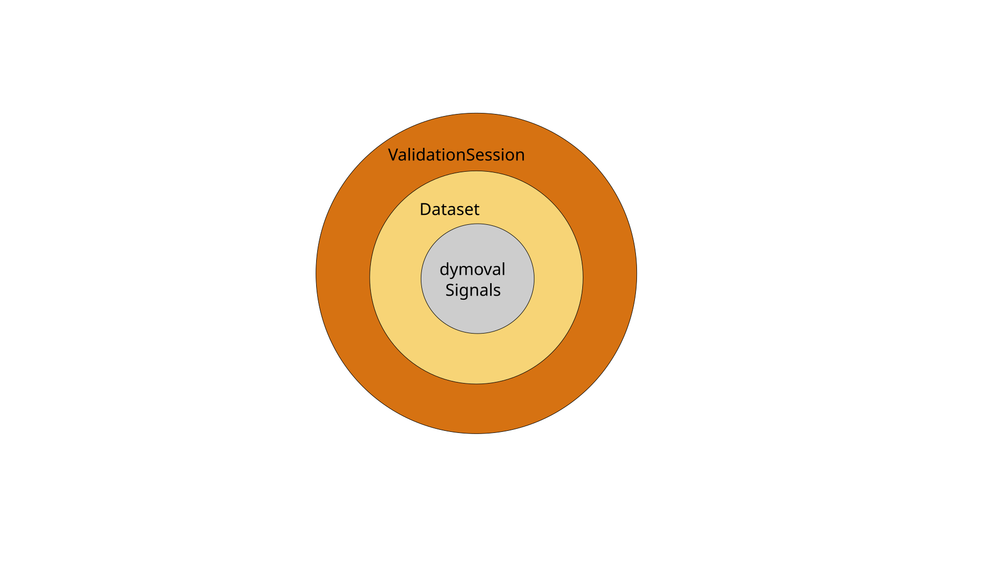

Reference Manual
================

The ingredients for validating a model are the *model* itself, a *measurements
dataset* and some *validation metrics*. *Dymoval* is not a modeling tool, so
its focus areas are the last two:

-  :doc:`./reference_index/dataset`
-  :doc:`./reference_index/validation`

Dymoval Architecture
--------------------

*Dymoval* is built on *numpy*, *scipy* and *matplotlib*. Those packages are
excellent but broad, and figuring out which of their thousands of functions
you need for a validation campaign takes time. *Dymoval* wraps the handful
that matter into three nested objects:

   *Dymoval* structure: a :ref:`ValidationSession <ValidationSession>` owns a
   :ref:`Dataset <Dataset>`, which owns :ref:`Signals <signal>`.

Each layer has one job:

:ref:`Signal <signal>`
   One time-series, its unit and its time vector. It knows how to filter,
   trim, detrend and transform *itself*.

:ref:`Dataset <Dataset>`
   A group of :ref:`Signals <signal>` sharing one time vector, split into
   inputs and outputs. It knows how to *align* signals and how to lay out a
   figure made of many of them.

:ref:`ValidationSession <ValidationSession>`
   One :ref:`Dataset <Dataset>` plus the simulation results to be validated
   against it, and the metrics that score them.

You reach an inner object from an outer one through plain attribute access,
for example ``vs.dataset`` or ``ds.inputs["Voltage"]``, and nothing stops you
from using the underlying *numpy* arrays directly through
:py:attr:`Signal.values <dymoval.signal.Signal.values>`.

Copy-on-transform behavior
^^^^^^^^^^^^^^^^^^^^^^^^^^

Manipulation methods do not modify the calling object; they return a new
object. You must therefore re-assign the result::

   >>> ds.remove_mean()                 # discarded, ds is unchanged
   >>> ds_zero_mean = ds.remove_mean()  # this is what you want

The dataclasses and their underlying *numpy* arrays are not deeply immutable.
Treat their fields as owned data: prefer class methods or build a new instance
instead of assigning to attributes or mutating arrays in place.

Plots
^^^^^

Plotting functions and methods return a *matplotlib* ``Figure`` (or ``Axes``)
and never call ``show()``, so you can keep manipulating the result with the
full *matplotlib* API before displaying or saving it::

   >>> fig = ds.plot()
   >>> fig.suptitle("My measurements")
   >>> fig.savefig("measurements.png")

If your session is not interactive, call ``matplotlib.pyplot.show()`` yourself
once you are done.

Most of them also accept ``with_scope=True``, which adds an interactive
:ref:`scope <scopes>` panel to the figure. See :ref:`scopes` for the details.

Package structure
-----------------

*Dymoval*'s package is arranged in the following modules

.. currentmodule:: dymoval
.. autosummary::

   signal
   dataset
   frequency_response
   plotting
   scope
   statistics
   xcorrelation
   validation
   utils
   config

The domain dependencies are acyclic: ``signal`` knows nothing about
``dataset``, and ``dataset`` knows nothing about ``validation``. Domain
objects expose plotting methods and therefore use the internal figure and
scope infrastructure at their presentation boundary.

Everything you normally need is re-exported at the package top level, so
``import dymoval as dmv`` followed by ``dmv.Dataset``, ``dmv.Signal`` or
``dmv.validate_models`` is the intended way to use the package.

.. toctree::
   :hidden:

   reference_index/dataset
   reference_index/validation

..  vim: set ts=3 tw=78:
