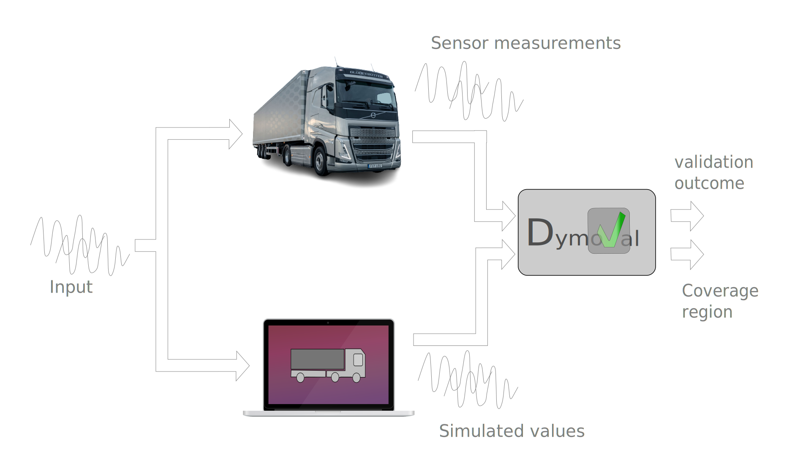

.. _modelvalidationtheory:

###########################
 What is model validation?
###########################

Imagine you are developing an innovative product or process. At various
stages, you need to test it. Based on the test outcomes, you adjust your
development direction. This cycle of development and testing continues
iteratively until you achieve a deployable product.

Typically, testing in the target environment—the real-world setting where your
product or service will ultimately be deployed—incurs costs in terms of money,
time, and often personal stress.

To alleviate these challenges, you can run your tests in a virtual environment
that models your target environment. If your work-product performs well in
this virtual setting, it should theoretically perform well in the real-world
environment too.

However, this assumption holds true only if your virtual environment
accurately represents the target environment and behaves similarly.

A typical validation process consists of the following steps:

#. **Design a Set of Experiments**: Define a set of experiments to be carried
   out on the target environment, also known as the Design of Experiments
   (*DoE*). This involves specifying the set of stimuli (*input*) to be given
   to the target environment.

#. **Run Experiments on the Target Environment**: Execute the experiments
   designed in step 1 on the target environment and log its response. The
   combination of the input signals and the target environment's response is
   referred to as the *measurement dataset* (or simply dataset).

#. **Run the Same Experiments on Your Model**: Conduct the exact same
   experiments defined in step 1 on your model and log its response. The
   response of your model is referred to as the simulation results.

#. **Evaluate the Results**: Assess how "close" the simulation results from
   step 3 are to the logged responses from step 2 using specific validation
   metrics.

   The model validation process.  In this picture the validation method only
   returns a pass/fail value but in general it returns the evaluation of some
   model quality metrics.

If the results of step 4 are good, you can safely continue developing and
testing in the virtual environment. Most likely, things will work in the
target environment as well, but it is good practice to verify this
periodically.

Keep in mind that *“all models are wrong, but some are useful.”* ;-)

However, it is worth noting that your model is valid only within the region
covered by the measurements. If you plan to use your model with data outside
the measurements coverage region, then you have no guarantees that things will
work in the target environment as they did in the virtual environment.

   **Example** Let's show how steps 1-4 can be applied through a simple
   real-world example.

   Assume that you are developing some cool autonomous driving algorithm that
   shall be deployed in a car, which represent your *target environment*.

   Assume that your car model consider the following signals:

   #. *accelerator pedal position*,
   #. *steering wheel position* and
   #. *road profile*,

   as **inputs**, and the following signals:

   #. *longitudinal speed* and
   #. *lateral speed*.

   as **outputs**.

   Next, you want to validate your model.

   Steps 1-4 are carried out in the following way:

   #. **Design of Experiment (DoE)**: Choose a driving route with sufficient
      road slope variation. Plan to take a ride on that path with a
      challenging driving style, including sudden accelerations and abrupt
      steering movements. Congratulations! You have just created a Design of
      Experiment (DoE).

   #. **Data Collection:** Take a ride according to the plan. Log the input
      signals (i.e., the accelerator pedal position, the steering wheel
      position, and the road profile time-series) along with the output
      signals (i.e., longitudinal and lateral speed time-series) of the
      vehicle while driving. These logs represent your measurements dataset.
      Note how input and output are separated.

   #. **Model Simulation:** Feed your model with the input signals from the
      measurements dataset and log your model's output corresponding to the
      longitudinal and lateral vehicle speed dynamics, for which you also have
      the measurements data.

   #. **Comparison and Validation:** Compare the longitudinal and lateral
      vehicle speed time-series logged during the actual drive with the
      simulated results using specific validation metrics.

   You haven' finished yet. In-fact, when you develop and validate a model,
   you should also consider the coverage region of the model along with the
   validation results.

   If you logged data only in the *accelerator pedal position* range [0,40] %,
   the *steering angle* in the range [-2,2]° and the *road profile was flat*
   for all the time, then you have to deliver such an information along with
   your model to a potential model user.

The cost savings when using models are clear, but there is no free lunch. In
fact, the challenge lies in the design of good models.

Nevertheless, although the design of good models is an art that cannot be
completely automated, we can at least validate them automatically, and here is
where Dymoval comes into play. In fact, Dymoval will not help you in
developing any model at all; it will just tell you if your models are good or
not after you have developed them.

.. note::

   A small caution on the nomenclature used: we will interchangeably use the
   expressions *real-world system* and *target environment*. This because what
   Control System engineers call *system* is often referred as *environment*
   by Software Engineers. We also user interchangeably the words *measurements
   dataset* and *dataset*.

..
   vim: set ts=3 tw=78:
